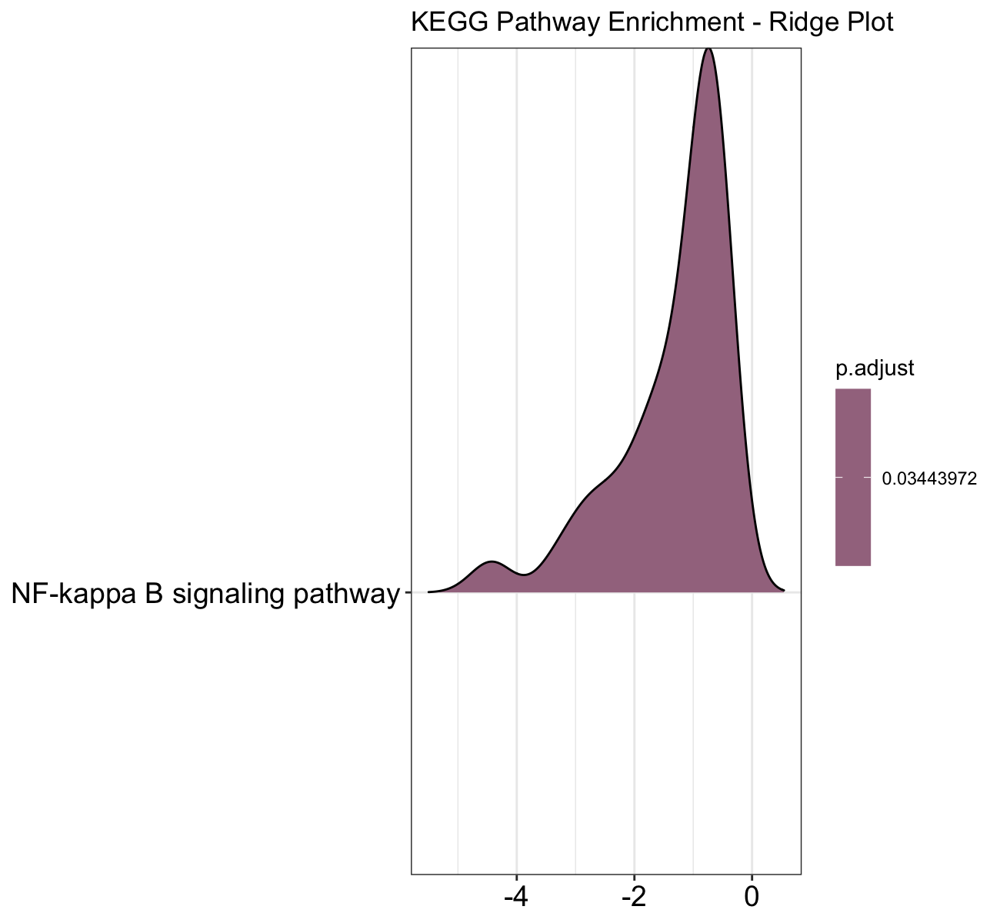
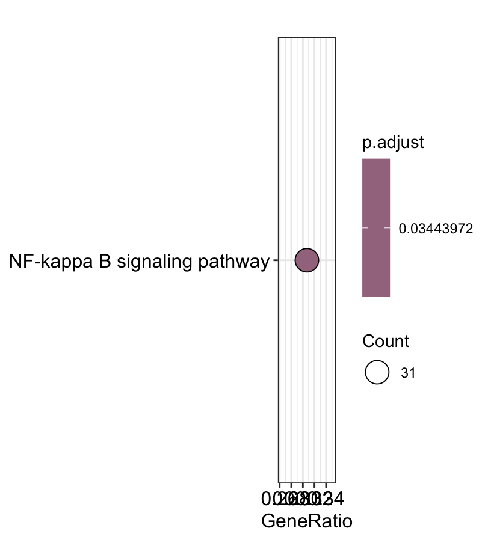
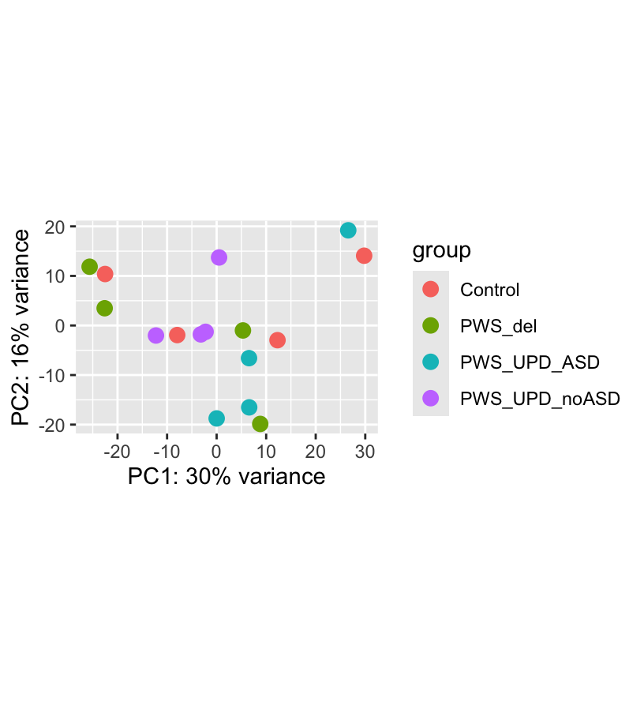

# Transcriptomic Analysis of ASD-Associated Molecular Signatures in Prader-Willi Syndrome iPSC-Derived Neurons

## Background
Prader-Willi Syndrome (PWS) is a complex neurodevelopmental disorder caused by the loss of function of specific genes on chromosome 15. Individuals with PWS often exhibit symptoms such as intellectual disability, behavioral problems, and an increased risk of autism spectrum disorder (ASD). Understanding the molecular mechanisms underlying these symptoms is crucial for developing targeted therapies.
Autism spectrum disorder (ASD) is a neurodevelopmental condition characterized by difficulties in social interaction, communication, and repetitive behaviors. Recent studies have suggested that there may be shared molecular pathways between PWS and ASD, which could provide insights into the pathophysiology of both conditions.

PWS has genetic subtypes (deletion/UPD)
ASD prevelence is higher in PWS with UPD than with deletion
Study aim: To investigate the transcriptomic profiles of iPSC-derived neurons from individuals with PWS and identify ASD-associated molecular signatures.

## Objective
1. Perform differential expression analysis using DESeq2 to identify genes that are differentially expressed between PWS and control neurons.
2. Compare
 *PWS_del vs Control
 *PWS_UPD_ASD vs Control
 *PWS_UPD_ASD vs PWS_UPD_noASD
3. Conduct GO Biological Process GSEA
4. Identify coordinated pathway level differences

## Methods
* DESeq2 for differential expression analysis
* Gene Set Enrichment Analysis (GSEA) for pathway analysis using log2fold change ranked gene lists
* clusterProfiler for enrichment analysis and visualization
* Variance stablizing transformation for PCA
* Contrast of interest: PWS_UPD_ASD vs PWS_UPD_noASD

## Key Findings
Contrary to expectations of mitochondrial enrichment, pathway analysis highlighted cytoskeletal and 
morphogenetic processes as primary transcriptional shifts associated with ASD phenotype.
* 34 signiicant genes found when comparing UPD_ASD vs Control group
* 49 significant genes found when comparing UPD_ASD vs UPD_noASD
* KEGG GSEA revealed significant downregulation of the NF-kappa B signaling pathway in UPD_ASD vs UPD_noASD, suggesting a potential link to immune dysregulation in ASD pathophysiology.
  * NES = -1.74, P.adj = 0.034
* Leading edge analysis identified key genes driving the NF-kappa B pathway downregulation, including:
  * IL1B
  * CXCL1
  * CXCL8
  * IRAK1
  * RELB
which are critical components of the pathway and may contribute to ASD-associated phenotypes in PWS.

## Interpretation
Results suggest reduced NF-kB transcriptional signaling in ASD-associated PWS neurons, potentially indicating altered neuronal stress-response pathwyas rather than classical neuroinflammation. 

## Figures
**Ridgeplot**

**KEGG Dot Plot**

**PCA**

# DPSC-derived-neurons
